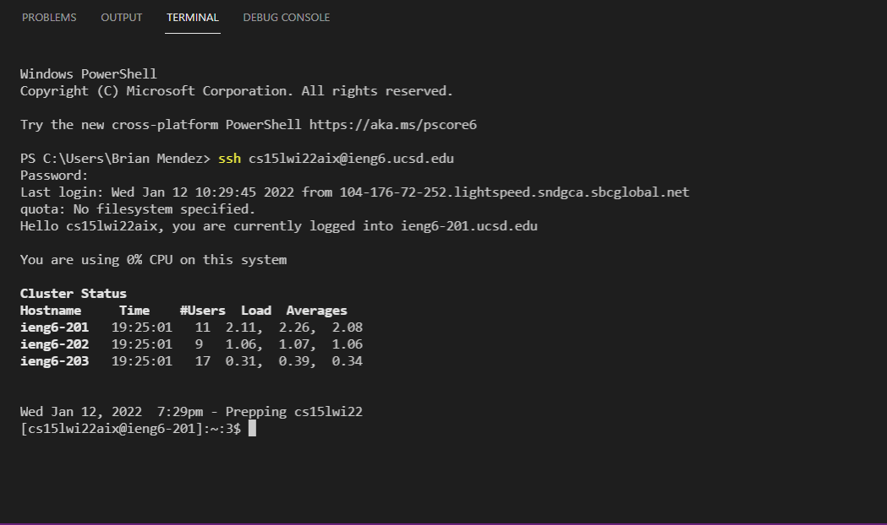
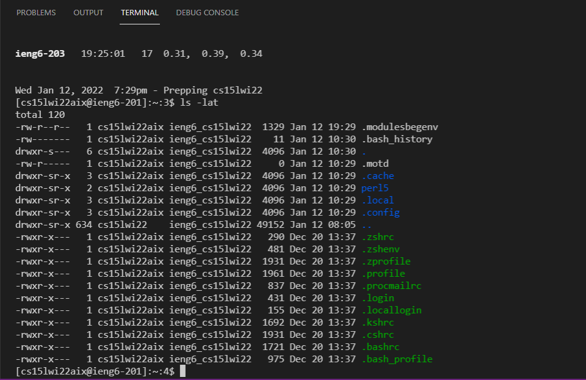
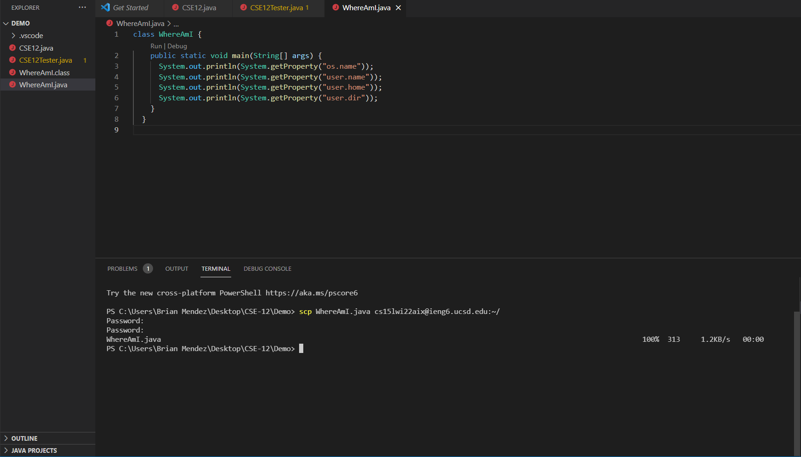
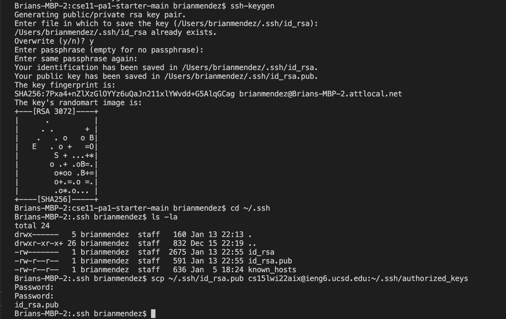
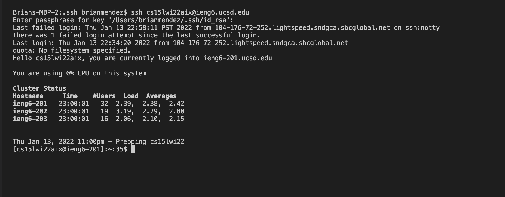
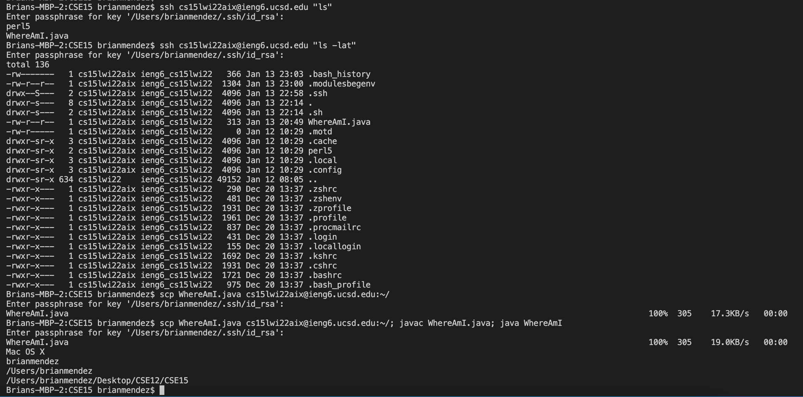

# Lab Report 1 - Week 2: Web developing

[Main Menu](https://b1mendez.github.io/cse15l-lab-report/) 

**Part 1: Setting up VS code**

No image needed because vs code was already installed on the computer. To install vs code, go to vscode website and download the latest version. When completing this, install the java extensions, which can be found towards the right activity bar. 

---
**Part 2: Remote Connectivity**

To connect your client to the server go to a command terminal (cmd) or the terminal in vscode (vs code terminal is used in this example). Your ssh command followed by your account name will allow you to connect to the server. You will be followed by a password statement where you will copy and paste or type out your password in and successfully login to the server (do not worry if you can not see chararcters being typed, it is still taking in your input)  

---
**Part 3: Try Some New Commands**

 
When successfully connecting to the server you will be able to use a number of command like ls -lat (shown in the image). This command lists the directory contents in the server and associated with your account. 

---
**Part 4: Moving Files with scp** 

Using the scp command allows the user to move files within their machine onto the server associated with your account. Simply using the scp command followed by the name of the file and your account name will allow you to move that file onto the server. If successful you will be followed by a password output where you would input your password and if successful the terminal should output the file name you stored onto the server. 

---
**Part 5: Setting up SSH Key** 

The next step in setting up your account is setting up a ssh key which essentially allows the user to create a passpharse to enter your account instead of having to sign into the server using your password. To set up, input the ssh-keygen command (the screenshot explains the output you are presented with after entering the command). After completing, you will need to follow the next commands in order to associate your public key file with your account on the server. Using commands expressed in the image, your public keygen will be set up onto the server. 

---
**Part 6: Optimizing Remote Running**

 
When succesfully setting up the ssh keygen you will optimize your experience using some commands for the server associated with your account. The image displays an efficient way to both store, compile, and run a file using the passphrase the user implemented with their account. It took me round about 36 seconds to complete the first command and 13 keystrokes to complete, but would have been around 78 keystokes to type out the command entirely (I copied and pasted the command line). None the less, the optimization is there making some scenerios more efficient when using the keygen.  
